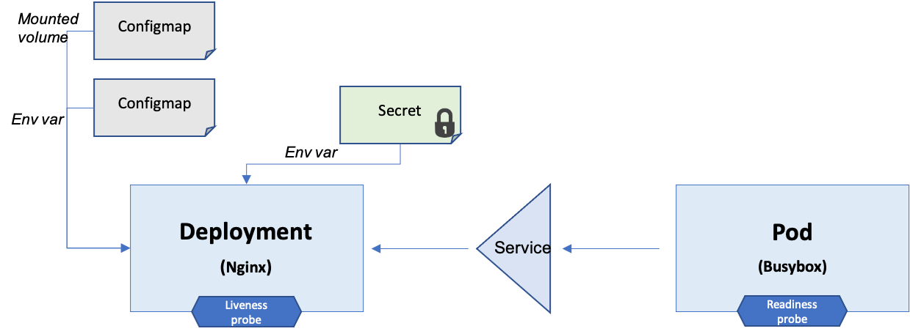
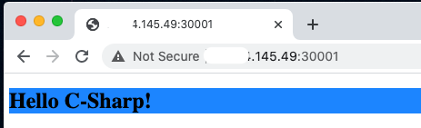

# Introduction 

This project is just to show a more complete example of using the K8s [CSharp Client library](https://github.com/kubernetes-client/csharp).

It uses the most common patterns in deployments and pods such as setting environment variables, mounting volumes, using init containers, etc.


 


# Using this example within a K8s cluster

all the instructions below assume you are in the top directory of the repo you cloned.

```
 tree -L 1
.
├── Dockerfile
├── Makefile
├── README.md
├── config
├── k8s-complete.csproj
├── k8s-complete.sln
└── src
```

To see the CSharp definitions of all the objects, you can look into this [file](./src/Factory.cs).

## Build and push Docker image, and create the K8s pod

To run the code as a container (or K8s pod) and avoid deploying dotnet on your local machine, you can build the code using docker build.

The Makefile will run the docker commands.

Make sure you did docker login if you intend to push to your docker registry

```shell
make docker-build
make docker-push # optional
make deploy
```

# Getting started for developers 

make sure kubeconfig exists in `~/.kube/config`, or `KUBECONFIG` env var is set to the kube config path.

The namespace is of the pods to monitor is specified as an environment variable = `NAMESPACE`. 


1.	Install dotnet
2.	dotnet restore
3.	dotnet run

## To clean up when you no longer need this functionality

```
To cleanup after, you can use:

```shell
make cleanup
```

## Manual testing

After running the code we should see the pods created and running.

```
kubectl get po
NAME                             READY   STATUS        RESTARTS   AGE
my-deployment-6f79b686c4-qcjrb   1/1     Running       0          27m
my-deployment-6f79b686c4-kcdqm   1/1     Running       0          27m
my-pod                           1/1     Running       0          27m
```

We can look into the env variables of the deployment pods: 

```
kubectl exec -ti my-deployment-6f79b686c4-qcjrb -- env
HOSTNAME=my-deployment-6f79b686c4-qcjrb
key1=data1-from-configmap
key2=data2-from-configmap
SECRET_KEY=data-from-secret
ENV1=regular-env1
ENV2=regular-env2
SECRET_KEY_TWO=more-data-from-secret
ENVFROMSECRET=data-from-secret
MY_POD_IP=10.1.93.59
MY_NAMESPACE=default
```

We should see all the env variables we set from the secret, configmap, and downward API

```
kubectl exec -ti my-deployment-6f79b686c4-qcjrb -- curl http://localhost:80
<!DOCTYPE html><html><body><h1 style=background-color:DodgerBlue;>Hello C-Sharp!</h1></body></html>
```
We should see nginx returning to content of the configmap we mounted as index.html

or you can use your machine browser, and direct it to the <node_IP_address:30001>, where port 30001 is nodePort we deifined in our service.




